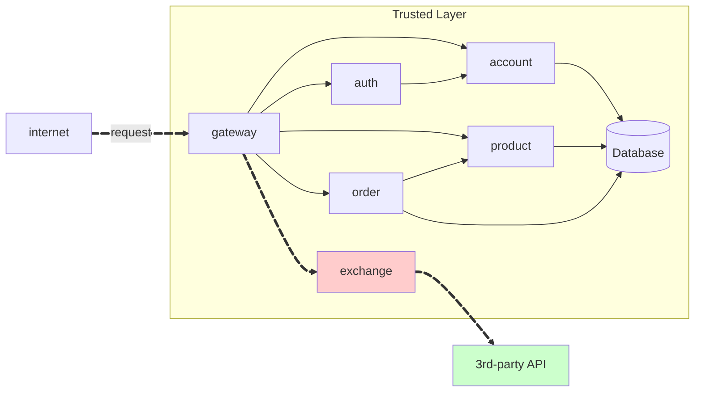

# Exchange API

A **Exchange API** é um microsserviço desenvolvido em **Python** com **FastAPI** que permite converter valores entre diferentes moedas, utilizando taxas de câmbio 

---

## Visão Geral



!!! tip "API Externa de Câmbio"
    O serviço Exchange utiliza a **Exchange Rate API** para obter taxas de câmbio em tempo real:

    - **URL**: `https://api.exchangerate-api.com/v4/latest/{moeda}`
    - **Exemplo**: `https://api.exchangerate-api.com/v4/latest/USD`

    O serviço aplica um spread de 2% sobre as taxas obtidas para calcular os valores de compra e venda


---

## Endpoints

!!! info "GET /exchange/{from}/{to}"

    Obtém a taxa de câmbio entre duas moedas.

    === "Request"

        ```bash
        GET /exchange/USD/EUR
        Authorization: Bearer <jwt>
        ```

    === "Response"

        ``` { .json .copy .select linenums='1' }
        {
            "sell": 0.82,
            "buy": 0.80,
            "date": "2021-09-01 14:23:42",
            "id_account": "0195ae95-5be7-7dd3-b35d-7a7d87c404fb"
        }
        ```
        ```bash
        Response code: 200 (ok)
        Response code: 400 (bad request), se a moeda não existir
        Response code: 401 (unauthorized), se o token for inválido
        Response code: 503 (service unavailable), se a API externa falhar
        ```

!!! info "GET /status"

    Verifica o status do serviço.

    === "Response"

        ``` { .json .copy .select linenums='1' }
        {
            "status": "ok",
            "service": "exchange"
        }
        ```
        ```bash
        Response code: 200 (ok)
        ```

---

## Implementação

### Exchange API (Python + FastAPI)


``` tree
api/
    exchange/
        main.py
        requirements.txt
        Dockerfile
        .gitignore
```

??? info "Código Fonte"

    === "main.py"

        ``` { .python .copy .select linenums='1' }
        from fastapi import FastAPI, HTTPException, Depends, Header
        from fastapi.security import HTTPBearer, HTTPAuthorizationCredentials
        from pydantic import BaseModel
        from typing import Optional
        import requests
        import os
        from datetime import datetime
        import uuid

        app = FastAPI(title="Exchange API")
        security = HTTPBearer()

        # Configurações
        EXCHANGE_API_KEY = os.getenv("EXCHANGE_API_KEY")
        EXCHANGE_API_URL = os.getenv("EXCHANGE_API_URL", "https://api.exchangerate-api.com/v4/latest")

        class ExchangeResponse(BaseModel):
            sell: float
            buy: float
            date: str
            id_account: str

        class ExchangeService:
            def __init__(self):
                self.api_key = EXCHANGE_API_KEY
                self.api_url = EXCHANGE_API_URL

            def get_exchange_rate(self, from_currency: str, to_currency: str) -> dict:
                try:
                    url = f"{self.api_url}/{from_currency.upper()}"
                    response = requests.get(url, timeout=10)
                    response.raise_for_status()

                    data = response.json()
                    rate = data.get("rates", {}).get(to_currency.upper())

                    if not rate:
                        raise HTTPException(
                            status_code=400,
                            detail=f"Currency {to_currency} not found"
                        )

                    spread = 0.02
                    buy_rate = rate * (1 - spread/2)
                    sell_rate = rate * (1 + spread/2)

                    return {
                        "buy": round(buy_rate, 4),
                        "sell": round(sell_rate, 4),
                        "rate": rate
                    }

                except requests.exceptions.RequestException as e:
                    raise HTTPException(
                        status_code=503,
                        detail=f"External API error: {str(e)}"
                    )

        def verify_token(credentials: HTTPAuthorizationCredentials = Depends(security)):
            token = credentials.credentials

            if not token or len(token) < 10:
                raise HTTPException(
                    status_code=401,
                    detail="Invalid or missing token"
                )

            return token

        def get_account_id_from_token(token: str) -> str:
            return str(uuid.uuid5(uuid.NAMESPACE_DNS, token))

        exchange_service = ExchangeService()

        @app.get("/exchange/{from_currency}/{to_currency}", response_model=ExchangeResponse)
        async def get_exchange_rate(
            from_currency: str,
            to_currency: str,
            token: str = Depends(verify_token)
        ):
            if len(from_currency) != 3 or len(to_currency) != 3:
                raise HTTPException(
                    status_code=400,
                    detail="Currency codes must be 3 characters long"
                )

            if from_currency.upper() == to_currency.upper():
                raise HTTPException(
                    status_code=400,
                    detail="Source and target currencies cannot be the same"
                )

            rate_data = exchange_service.get_exchange_rate(from_currency, to_currency)
            account_id = get_account_id_from_token(token)

            return ExchangeResponse(
                sell=rate_data["sell"],
                buy=rate_data["buy"],
                date=datetime.now().strftime("%Y-%m-%d %H:%M:%S"),
                id_account=account_id
            )

        @app.get("/status")
        async def status():
            return {"status": "ok", "service": "exchange"}
        ```

    === "requirements.txt"

        ``` { .txt .copy .select linenums='1' }
        fastapi==0.104.1
        uvicorn==0.24.0
        requests==2.31.0
        python-jose[cryptography]==3.3.0
        python-multipart==0.0.6
        pydantic==2.5.0
        python-dotenv==1.0.0
        ```

    === "Dockerfile"

        ``` { .dockerfile .copy .select linenums='1' }
        FROM python:3.11-slim

        WORKDIR /app

        # Instalar dependências do sistema
        RUN apt-get update && apt-get install -y \
            gcc \
            && rm -rf /var/lib/apt/lists/*

        # Copiar requirements e instalar dependências Python
        COPY requirements.txt .
        RUN pip install --no-cache-dir -r requirements.txt

        # Copiar código da aplicação
        COPY . .

        # Expor porta
        EXPOSE 8000

        # Comando para executar a aplicação
        CMD ["uvicorn", "main:app", "--host", "0.0.0.0", "--port", "8000"]
        ```

<!-- termynal -->

``` { bash }
> pip install -r requirements.txt
> uvicorn main:app --reload
```


---


---

## Repositórios

| Componente | Repositório |
|------------|-------------|
| Exchange | [exchange](https://github.com/isavrodrigues/exchange) |
| Product | [product](https://github.com/isavrodrigues/product) / [product-service](https://github.com/isavrodrigues/product-service) |
| Order | [order](https://github.com/isavrodrigues/order) / [order-service](https://github.com/isavrodrigues/order-service) |
| Auth | [auth](https://github.com/repo-classes/pma252.auth) / [auth-service](https://github.com/repo-classes/pma252.auth-service) |
| Gateway | [gateway-service](https://github.com/repo-classes/pma252.gateway-service) |
