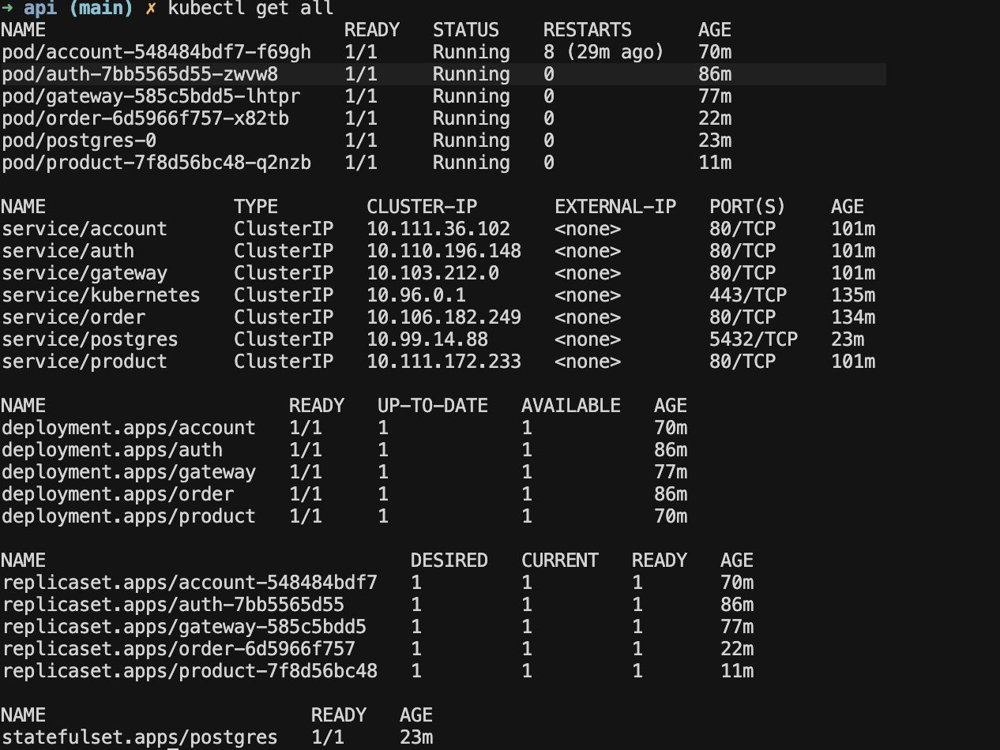

# Kubernetes

Deploy dos microsserviços em um cluster Kubernetes local (Minikube)

---

## Repositórios

- [Account Service](https://github.com/repo-classes/pma252.account-service)
- [Auth Service](https://github.com/repo-classes/pma252.auth-service)
- [Gateway Service](https://github.com/repo-classes/pma252.gateway-service)
- [Product Service](https://github.com/isavrodrigues/product-service)
- [Order Service](https://github.com/isavrodrigues/order-service)

---

## Estrutura do Projeto

``` tree
api/
├── account-service/
│   └── k8s/
│       └── k8s.yaml
├── auth-service/
│   └── k8s/
│       └── k8s.yaml
├── gateway-service/
│   └── k8s/
│       └── k8s.yaml
├── product-service/
│   └── k8s/
│       └── k8s.yaml
└── order-service/
    └── k8s/
        └── k8s.yaml
```

---

## Manifests K8s

??? info "Account Service"
    ``` { .yaml .copy .select linenums='1' }
    apiVersion: apps/v1
    kind: Deployment
    metadata:
      name: account
    spec:
      replicas: 1
      selector:
        matchLabels:
          app: account
      template:
        metadata:
          labels:
            app: account
        spec:
          containers:
            - name: account
              image: isavrodrigues/account:latest
              imagePullPolicy: Always
              ports:
                - containerPort: 8080
              env:
                - name: POSTGRES_DB
                  valueFrom:
                    configMapKeyRef:
                      name: postgres-configmap
                      key: POSTGRES_DB
                - name: DATABASE_USERNAME
                  valueFrom:
                    secretKeyRef:
                      name: postgres-secrets
                      key: POSTGRES_USER
                - name: DATABASE_PASSWORD
                  valueFrom:
                    secretKeyRef:
                      name: postgres-secrets
                      key: POSTGRES_PASSWORD
                - name: DATABASE_URL
                  value: "jdbc:postgresql://postgres:5432/$(POSTGRES_DB)"
              resources:
                requests:
                  memory: "200Mi"
                  cpu: "50m"
                limits:
                  memory: "300Mi"
                  cpu: "200m"

    ---

    apiVersion: v1
    kind: Service
    metadata:
      name: account
      labels:
        app: account
    spec:
      type: ClusterIP
      ports:
        - port: 80
          protocol: TCP
          targetPort: 8080
      selector:
        app: account
    ```

??? info "Auth Service"
    ``` { .yaml .copy .select linenums='1' }
    apiVersion: apps/v1
    kind: Deployment
    metadata:
      name: auth
    spec:
      replicas: 1
      selector:
        matchLabels:
          app: auth
      template:
        metadata:
          labels:
            app: auth
        spec:
          containers:
            - name: auth
              image: isavrodrigues/auth:latest
              imagePullPolicy: Always
              ports:
                - containerPort: 8080
              env:
                - name: POSTGRES_DB
                  valueFrom:
                    configMapKeyRef:
                      name: postgres-configmap
                      key: POSTGRES_DB
                - name: DATABASE_USERNAME
                  valueFrom:
                    secretKeyRef:
                      name: postgres-secrets
                      key: POSTGRES_USER
                - name: DATABASE_PASSWORD
                  valueFrom:
                    secretKeyRef:
                      name: postgres-secrets
                      key: POSTGRES_PASSWORD
                - name: DATABASE_URL
                  value: "jdbc:postgresql://postgres:5432/$(POSTGRES_DB)"
              resources:
                requests:
                  memory: "200Mi"
                  cpu: "50m"
                limits:
                  memory: "300Mi"
                  cpu: "200m"

    ---

    apiVersion: v1
    kind: Service
    metadata:
      name: auth
      labels:
        app: auth
    spec:
      type: ClusterIP
      ports:
        - port: 80
          protocol: TCP
          targetPort: 8080
      selector:
        app: auth
    ```

??? info "Gateway Service"
    ``` { .yaml .copy .select linenums='1' }
    apiVersion: apps/v1
    kind: Deployment
    metadata:
      name: gateway
    spec:
      replicas: 1
      selector:
        matchLabels:
          app: gateway
      template:
        metadata:
          labels:
            app: gateway
        spec:
          containers:
            - name: gateway
              image: isavrodrigues/gateway:latest
              imagePullPolicy: Always
              ports:
                - containerPort: 8080
              env:
                - name: POSTGRES_DB
                  valueFrom:
                    configMapKeyRef:
                      name: postgres-configmap
                      key: POSTGRES_DB
                - name: DATABASE_USERNAME
                  valueFrom:
                    secretKeyRef:
                      name: postgres-secrets
                      key: POSTGRES_USER
                - name: DATABASE_PASSWORD
                  valueFrom:
                    secretKeyRef:
                      name: postgres-secrets
                      key: POSTGRES_PASSWORD
                - name: DATABASE_URL
                  value: "jdbc:postgresql://postgres:5432/$(POSTGRES_DB)"
              resources:
                requests:
                  memory: "200Mi"
                  cpu: "50m"
                limits:
                  memory: "300Mi"
                  cpu: "200m"

    ---

    apiVersion: v1
    kind: Service
    metadata:
      name: gateway
      labels:
        app: gateway
    spec:
      type: ClusterIP
      ports:
        - port: 80
          protocol: TCP
          targetPort: 8080
      selector:
        app: gateway
    ```

??? info "Product Service"
    ``` { .yaml .copy .select linenums='1' }
    apiVersion: apps/v1
    kind: Deployment
    metadata:
      name: product
    spec:
      replicas: 1
      selector:
        matchLabels:
          app: product
      template:
        metadata:
          labels:
            app: product
        spec:
          containers:
            - name: product
              image: isavrodrigues/product:latest
              imagePullPolicy: Always
              ports:
                - containerPort: 8080
              env:
                - name: POSTGRES_DB
                  valueFrom:
                    configMapKeyRef:
                      name: postgres-configmap
                      key: POSTGRES_DB
                - name: DATABASE_USERNAME
                  valueFrom:
                    secretKeyRef:
                      name: postgres-secrets
                      key: POSTGRES_USER
                - name: DATABASE_PASSWORD
                  valueFrom:
                    secretKeyRef:
                      name: postgres-secrets
                      key: POSTGRES_PASSWORD
                - name: DATABASE_URL
                  value: "jdbc:postgresql://postgres:5432/$(POSTGRES_DB)"
              resources:
                requests:
                  memory: "200Mi"
                  cpu: "50m"
                limits:
                  memory: "300Mi"
                  cpu: "200m"

    ---

    apiVersion: v1
    kind: Service
    metadata:
      name: product
      labels:
        app: product
    spec:
      type: ClusterIP
      ports:
        - port: 80
          protocol: TCP
          targetPort: 8080
      selector:
        app: product
    ```

??? info "Order Service"
    ``` { .yaml .copy .select linenums='1' }
    apiVersion: apps/v1
    kind: Deployment
    metadata:
      name: order
    spec:
      replicas: 1
      selector:
        matchLabels:
          app: order
      template:
        metadata:
          labels:
            app: order
        spec:
          containers:
            - name: order
              image: isavrodrigues/order:latest
              imagePullPolicy: Always
              ports:
                - containerPort: 8080
              env:
                - name: POSTGRES_DB
                  valueFrom:
                    configMapKeyRef:
                      name: postgres-configmap
                      key: POSTGRES_DB
                - name: DATABASE_USERNAME
                  valueFrom:
                    secretKeyRef:
                      name: postgres-secrets
                      key: POSTGRES_USER
                - name: DATABASE_PASSWORD
                  valueFrom:
                    secretKeyRef:
                      name: postgres-secrets
                      key: POSTGRES_PASSWORD
                - name: DATABASE_URL
                  value: "jdbc:postgresql://postgres:5432/$(POSTGRES_DB)"
              resources:
                requests:
                  memory: "200Mi"
                  cpu: "50m"
                limits:
                  memory: "300Mi"
                  cpu: "200m"

    ---

    apiVersion: v1
    kind: Service
    metadata:
      name: order
      labels:
        app: order
    spec:
      type: ClusterIP
      ports:
        - port: 80
          protocol: TCP
          targetPort: 8080
      selector:
        app: order
    ```

---

## Serviços Rodando


