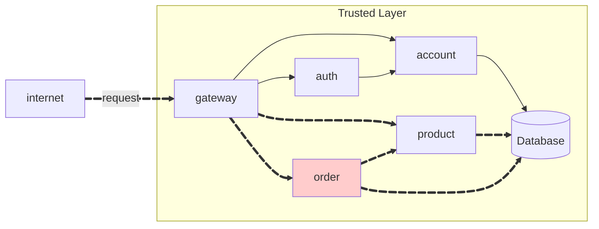
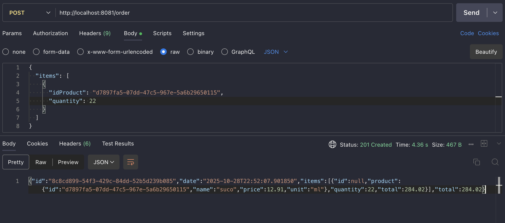

# Order API

A **Order API** implementa o gerenciamento de pedidos, seguindo uma arquitetura de microsserviços com **interface** (`order`) e **service** (`order-service`) protegidos por autenticação **JWT** através do **gateway**.


---

## Visão Geral




---

## Endpoints

!!! info "POST /order"

    Cria um novo pedido para o usuário autenticado.

    === "Request"

        ``` { .json .copy .select linenums='1' }
        {
            "items": [
                {
                    "idProduct": "0195abfb-7074-73a9-9d26-b4b9fbaab0a8",
                    "quantity": 2
                },
                {
                    "idProduct": "0195abfe-e416-7052-be3b-27cdaf12a984",
                    "quantity": 10
                }
            ]
        }
        ```

    === "Response"

        ``` { .json .copy .select linenums='1' }
        {
            "id": "0195ac33-73e5-7cb3-90ca-7b5e7e549569",
            "date": "2025-09-01T12:30:00",
            "items": [
                {
                    "id": "01961b9a-bca2-78c4-9be1-7092b261f217",
                    "product": {
                        "id": "0195abfb-7074-73a9-9d26-b4b9fbaab0a8"
                    },
                    "quantity": 2,
                    "total": 20.24
                },
                {
                    "id": "01961b9b-08fd-76a5-8508-cdb6cd5c27ab",
                    "product": {
                        "id": "0195abfe-e416-7052-be3b-27cdaf12a984"
                    },
                    "quantity": 10,
                    "total": 6.2
                }
            ],
            "total": 26.44
        }
        ```
        ```bash
        Response code: 201 (created)
        Response code: 400 (bad request), se o produto não existir
        ```

    === "Postman"

        

!!! info "GET /order"

    Lista todos os pedidos do usuário autenticado.

    === "Response"

        ``` { .json .copy .select linenums='1' }
        [
            {
                "id": "0195ac33-73e5-7cb3-90ca-7b5e7e549569",
                "date": "2025-09-01T12:30:00",
                "total": 26.44
            },
            {
                "id": "0195ac33-cbbd-7a6e-a15b-b85402cf143f",
                "date": "2025-10-09T03:21:57",
                "total": 18.6
            }
        ]
        ```
        ```bash
        Response code: 200 (ok)
        ```

!!! info "GET /order/{id}"

    Busca os detalhes de um pedido específico. O pedido deve pertencer ao usuário autenticado.

    === "Response"

        ``` { .json .copy .select linenums='1' }
        {
            "id": "0195ac33-73e5-7cb3-90ca-7b5e7e549569",
            "date": "2025-09-01T12:30:00",
            "items": [
                {
                    "id": "01961b9a-bca2-78c4-9be1-7092b261f217",
                    "product": {
                        "id": "0195abfb-7074-73a9-9d26-b4b9fbaab0a8"
                    },
                    "quantity": 2,
                    "total": 20.24
                },
                {
                    "id": "01961b9b-08fd-76a5-8508-cdb6cd5c27ab",
                    "product": {
                        "id": "0195abfe-e416-7052-be3b-27cdaf12a984"
                    },
                    "quantity": 10,
                    "total": 6.2
                }
            ],
            "total": 26.44
        }
        ```
        ```bash
        Response code: 200 (ok)
        Response code: 404 (not found), se o pedido não pertencer ao usuário
        ```

---

## Implementação

### Order (Interface)

Módulo que define o contrato da API através de Feign Client.

``` tree
api/
    order/
        src/
            main/
                java/
                    store/
                        order/
                            OrderController.java
                            OrderIn.java
                            OrderItemIn.java
                            OrderOut.java
                            OrderItemOut.java
        pom.xml
```

??? info "Código Fonte"

    === "OrderController.java"

        ``` { .java .copy .select linenums='1' }
        package store.order;

        import java.util.List;

        import org.springframework.cloud.openfeign.FeignClient;
        import org.springframework.http.ResponseEntity;
        import org.springframework.web.bind.annotation.*;

        @FeignClient(name = "order", url = "http://order:8080")
        public interface OrderController {

            @PostMapping("/order")
            ResponseEntity<OrderOut> create(@RequestBody OrderIn in);

            @GetMapping("/order")
            ResponseEntity<List<OrderOut>> findAll();

            @GetMapping("/order/{id}")
            ResponseEntity<OrderOut> findById(@PathVariable("id") String id);
        }
        ```

    === "OrderIn.java"

        ``` { .java .copy .select linenums='1' }
        package store.order;

        import java.util.List;
        import lombok.Builder;

        @Builder
        public record OrderIn(List<OrderItemIn> items) {
        }
        ```

    === "OrderItemIn.java"

        ``` { .java .copy .select linenums='1' }
        package store.order;

        import lombok.Builder;

        @Builder
        public record OrderItemIn(String idProduct, Integer quantity) {}
        ```

    === "OrderOut.java"

        ``` { .java .copy .select linenums='1' }
        package store.order;

        import lombok.Builder;
        import java.util.List;

        @Builder
        public record OrderOut(
            String id,
            String date,
            List<OrderItemOut> items,
            Double total) {
        }
        ```

    === "OrderItemOut.java"

        ``` { .java .copy .select linenums='1' }
        package store.order;

        import lombok.Builder;
        import store.product.ProductOut;

        @Builder
        public record OrderItemOut(
            String id,
            ProductOut product,
            Integer quantity,
            Double total
        ){

        }
        ```

<!-- termynal -->

``` { bash }
> mvn clean install
```

---

### Order-Service (Implementação)

Serviço que implementa a lógica de negócio e persistência dos pedidos.

``` tree
api/
    order-service/
        src/
            main/
                java/
                    store/
                        order/
                            Order.java
                            OrderItem.java
                            OrderModel.java
                            OrderParser.java
                            OrderRepository.java
                            OrderResource.java
                            OrderService.java
                resources/
                    application.yaml
                    db/
                        migration/
                            V2025.01.01.001__create_schema.sql
                            V2025.01.01.002__create_table_order.sql
        pom.xml
        Dockerfile
```

??? info "Código Fonte"

    === "Order.java"

        ``` { .java .copy .select linenums='1' }
        package store.order;

        import java.time.LocalDateTime;
        import java.util.List;

        import lombok.Builder;
        import lombok.Data;
        import lombok.experimental.Accessors;

        @Builder
        @Data
        @Accessors(fluent = true, chain = true)
        public class Order {

            private String id;
            private String accountId;
            private LocalDateTime date;
            private List<OrderItem> items;
            private Double total;

        }
        ```

    === "OrderItem.java"

        ``` { .java .copy .select linenums='1' }
        package store.order;

        import lombok.Builder;
        import lombok.Data;
        import lombok.experimental.Accessors;

        @Builder @Data @Accessors(fluent = true, chain = true)
        public class OrderItem {

            private String productId;
            private Integer quantity;
            private Double price;

        }
        ```

    === "OrderModel.java"

        ``` { .java .copy .select linenums='1' }
        package store.order;

        import jakarta.persistence.Column;
        import jakarta.persistence.Entity;
        import jakarta.persistence.GeneratedValue;
        import jakarta.persistence.GenerationType;
        import jakarta.persistence.Id;
        import jakarta.persistence.Table;
        import lombok.AllArgsConstructor;
        import lombok.NoArgsConstructor;
        import lombok.Setter;
        import lombok.experimental.Accessors;

        @Entity
        @Table(name = "orders")
        @Setter @Accessors(chain = true, fluent = true)
        @NoArgsConstructor @AllArgsConstructor
        public class OrderModel {

            @Id
            @Column(name = "id")
            @GeneratedValue(strategy = GenerationType.UUID)
            private String id;

            @Column(name = "id_account")
            private String accountId;

            @Column(name = "date")
            private String date;

            @Column(name = "items_json", length = 4000)
            private String itemsJson;

            @Column(name = "total")
            private Double total;

            public OrderModel(Order o) {
                this.id = o.id();
                this.accountId = o.accountId();
                this.date = o.date() != null ? o.date().toString() : null;
                this.itemsJson = OrderParser.writeItemsJson(o.items());
                this.total = o.total();
            }

            public Order to() {
                return Order.builder()
                    .id(this.id)
                    .accountId(this.accountId)
                    .date(this.date != null ? java.time.LocalDateTime.parse(this.date) : null)
                    .items(OrderParser.parseItemsJson(this.itemsJson))
                    .total(this.total)
                    .build();
            }
        }
        ```

    === "OrderParser.java"

        ``` { .java .copy .select linenums='1' }
        package store.order;

        import com.fasterxml.jackson.core.JsonProcessingException;
        import com.fasterxml.jackson.core.type.TypeReference;
        import com.fasterxml.jackson.databind.ObjectMapper;

        import java.util.List;
        import java.util.ArrayList;

        public final class OrderParser {

            private static final ObjectMapper MAPPER = new ObjectMapper();

            private OrderParser() {}

            public static List<OrderItem> parseItemsJson(String json) {
                if (json == null || json.isBlank()) return new ArrayList<>();
                try {
                    return MAPPER.readValue(json, new TypeReference<List<OrderItem>>() {});
                } catch (JsonProcessingException e) {
                    return new ArrayList<>();
                }
            }

            public static String writeItemsJson(List<OrderItem> items) {
                if (items == null) return null;
                try {
                    return MAPPER.writeValueAsString(items);
                } catch (JsonProcessingException e) {
                    return null;
                }
            }
        }
        ```

    === "OrderResource.java"

        ``` { .java .copy .select linenums='1' }
        package store.order;

        import org.springframework.http.ResponseEntity;
        import org.springframework.validation.annotation.Validated;
        import org.springframework.web.bind.annotation.*;

        import java.net.URI;

        @RestController
        @RequestMapping("/order")
        @Validated
        public class OrderResource {

            private final OrderService service;

            public OrderResource(OrderService service) {
                this.service = service;
            }

            @PostMapping
            public ResponseEntity<Order> create(@RequestBody Order in) {
                var created = service.create(in, "account-1"); // sem autenticação real
                return ResponseEntity.created(URI.create("/order/" + created.id())).body(created);
            }

            @GetMapping("/{id}")
            public ResponseEntity<Order> findById(@PathVariable("id") String id) {
                return service.findById(id)
                        .map(ResponseEntity::ok)
                        .orElse(ResponseEntity.notFound().build());
            }
        }
        ```

    === "OrderService.java"

        ``` { .java .copy .select linenums='1' }
        package store.order;

        import org.springframework.stereotype.Service;
        import org.springframework.transaction.annotation.Transactional;

        import java.time.LocalDateTime;
        import java.util.Optional;
        import java.util.UUID;

        @Service
        @Transactional
        public class OrderService {

            private final OrderRepository repository;

            public OrderService(OrderRepository repository) {
                this.repository = repository;
            }

            public Order create(Order in, String currentAccountId) {
                var total = in.items() == null ? 0.0 :
                    in.items().stream()
                        .mapToDouble(i -> i.price() * i.quantity())
                        .sum();

                var order = Order.builder()
                    .id(UUID.randomUUID().toString())
                    .accountId(currentAccountId)
                    .date(LocalDateTime.now())
                    .items(in.items())
                    .total(total)
                    .build();

                repository.save(new OrderModel(order));
                return order;
            }

            public Optional<Order> findById(String id) {
                return repository.findById(id).map(OrderModel::to);
            }
        }
        ```

    === "OrderRepository.java"

        ``` { .java .copy .select linenums='1' }
        package store.order;

        import org.springframework.data.repository.CrudRepository;
        import org.springframework.stereotype.Repository;

        @Repository
        public interface OrderRepository extends CrudRepository<OrderModel, String> {
        }
        ```

    === "application.yaml"

        ``` { .yaml .copy .select linenums='1' }
        server:
          port: 8080

        spring:
          application:
            name: order

          mvc:
            problemdetails:
              enabled: true

          datasource:
            url: ${DATABASE_URL}
            username: ${DATABASE_USERNAME}
            password: ${DATABASE_PASSWORD}
            driver-class-name: org.postgresql.Driver

          flyway:
            baseline-on-migrate: true
            schemas: orders

          jpa:
            properties:
              hibernate:
                default_schema: orders

        logging:
          level:
            store: debug

        management:
          endpoints:
            web:
              exposure:
                include: health,info
          endpoint:
            health:
              show-details: always
        ```

<!-- termynal -->

``` { bash }
> mvn clean package spring-boot:run
```

---

## Repositórios

| Componente | Interface | Implementação |
|------------|-----------|---------------|
| Order | [order](https://github.com/isavrodrigues/order) | [order-service](https://github.com/isavrodrigues/order-service) |
| Product | [product](https://github.com/isavrodrigues/product) | [product-service](https://github.com/isavrodrigues/product-service) |
| Auth | [auth](https://github.com/repo-classes/pma252.auth) | [auth-service](https://github.com/repo-classes/pma252.auth-service) |
| Gateway | - | [gateway-service](https://github.com/repo-classes/pma252.gateway-service) |
