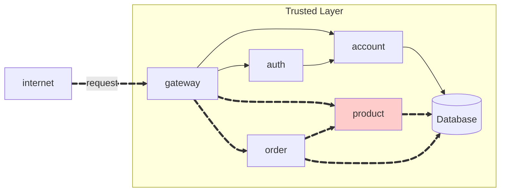
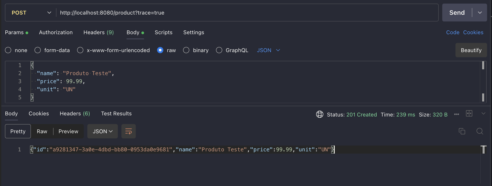
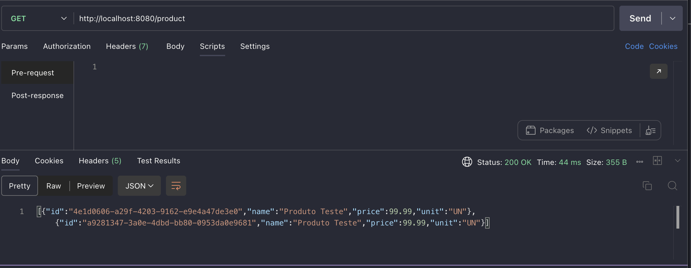
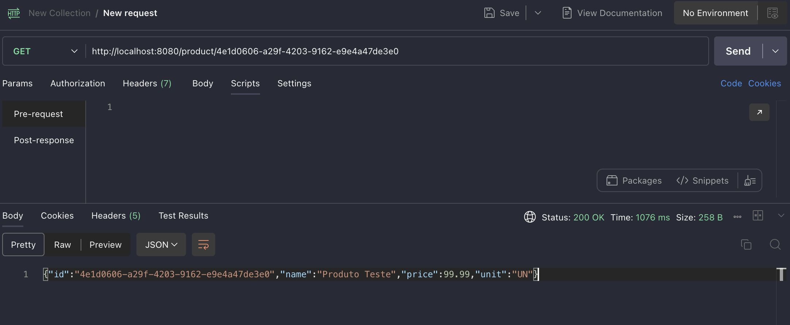

# Product API

A **Product API** implementa o CRUD de produtos, seguindo uma arquitetura de microsserviços com **interface** (`product`) e **service** (`product-service`)


---

## Visão Geral




---

## Endpoints

!!! info "POST /product"

    Cria um novo produto.

    === "Request"

        ``` { .json .copy .select linenums='1' }
        {
            "name": "Produto Teste",
            "price": 99.99,
            "unit": "UN"
        }
        ```

    === "Response"

        ``` { .json .copy .select linenums='1' }
        {
            "id": "a9281347-3a0e-4dbd-bb80-0953da0e9681",
            "name": "Produto Teste",
            "price": 99.99,
            "unit": "UN"
        }
        ```
        ```bash
        Response code: 201 (created)
        ```

    === "Postman"
        

!!! info "GET /product"

    Lista todos os produtos.

    === "Response"

        ``` { .json .copy .select linenums='1' }
        [
            {
                "id": "4e1d0606-a29f-4203-9162-e9e4a47de3e0",
                "name": "Produto Teste",
                "price": 99.99,
                "unit": "UN"
            },
            {
                "id": "a9281347-3a0e-4dbd-bb80-0953da0e9681",
                "name": "Produto Teste",
                "price": 99.99,
                "unit": "UN"
            }
        ]
        ```
        ```bash
        Response code: 200 (ok)
        ```

    === "Postman"
        

!!! info "GET /product/{id}"

    Busca um produto específico pelo ID.

    === "Response"

        ``` { .json .copy .select linenums='1' }
        {
            "id": "4e1d0606-a29f-4203-9162-e9e4a47de3e0",
            "name": "Produto Teste",
            "price": 99.99,
            "unit": "UN"
        }
        ```
        ```bash
        Response code: 200 (ok)
        ```

    === "Postman"
        

!!! info "DELETE /product/{id}"

    Deleta um produto pelo ID.

    ```bash
    Response code: 204 (no content)
    ```

---

## Implementação

### Product (Interface)

Módulo que define o contrato da API através de Feign Client.

``` tree
api/
    product/
        src/
            main/
                java/
                    store/
                        product/
                            ProductController.java
                            ProductIn.java
                            ProductOut.java
        pom.xml
```

??? info "Código Fonte"

    === "ProductController.java"

        ``` { .java .copy .select linenums='1' }
        package store.product;

        import java.util.List;

        import org.springframework.cloud.openfeign.FeignClient;
        import org.springframework.http.ResponseEntity;
        import org.springframework.web.bind.annotation.DeleteMapping;
        import org.springframework.web.bind.annotation.GetMapping;
        import org.springframework.web.bind.annotation.PathVariable;
        import org.springframework.web.bind.annotation.PostMapping;
        import org.springframework.web.bind.annotation.RequestBody;

        @FeignClient(name = "product", url = "http://product:8080")
        public interface ProductController {

            @PostMapping("/product")
            public ResponseEntity<ProductOut> create(
                @RequestBody ProductIn in
            );

            @GetMapping("/product")
            public ResponseEntity<List<ProductOut>> findAll();

            @GetMapping("/product/{id}")
            public ResponseEntity<ProductOut> findById(
                @PathVariable("id") String id
            );

            @DeleteMapping("/product/{id}")
            public ResponseEntity<Void> delete(
                @PathVariable("id") String id
            );
        }
        ```

    === "ProductIn.java"

        ``` { .java .copy .select linenums='1' }
        package store.product;

        import lombok.Builder;

        @Builder
        public record ProductIn(
            String name,
            Double price,
            String unit
        ) {}
        ```

    === "ProductOut.java"

        ``` { .java .copy .select linenums='1' }
        package store.product;

        import lombok.Builder;

        @Builder
        public record ProductOut(
            String id,
            String name,
            Double price,
            String unit
        ) {}
        ```

<!-- termynal -->

``` { bash }
> mvn clean install
```

---

### Product-Service (Implementação)

Serviço que implementa a lógica de negócio e persistência dos produtos.

``` tree
api/
    product-service/
        src/
            main/
                java/
                    store/
                        product/
                            Product.java
                            ProductApplication.java
                            ProductRepository.java
                            ProductResource.java
                            ProductService.java
                resources/
                    application.yaml
                    db/
                        migration/
                            V2025.01.01.001__create_schema.sql
                            V2025.01.01.002__create_table_product.sql
        pom.xml
        Dockerfile
```

??? info "Código Fonte"

    === "Product.java"

        ``` { .java .copy .select linenums='1' }
        package store.product;

        import com.fasterxml.jackson.annotation.JsonAutoDetect;
        import lombok.Builder;
        import lombok.Data;
        import lombok.experimental.Accessors;

        @Builder
        @Data
        @Accessors(fluent = true, chain = true)
        @JsonAutoDetect(fieldVisibility = JsonAutoDetect.Visibility.ANY)
        public class Product {
            String id;
            String name;
            Double price;
            String unit;
        }
        ```

    === "ProductModel.java"

        ``` { .java .copy .select linenums='1' }
        package store.product;

        import jakarta.persistence.Column;
        import jakarta.persistence.Entity;
        import jakarta.persistence.GeneratedValue;
        import jakarta.persistence.GenerationType;
        import jakarta.persistence.Id;
        import jakarta.persistence.Table;
        import lombok.AllArgsConstructor;
        import lombok.Getter;
        import lombok.NoArgsConstructor;
        import lombok.Setter;

        @Entity
        @Table(schema = "product", name = "product")
        @Getter @Setter
        @NoArgsConstructor @AllArgsConstructor
        public class ProductModel {

            @Id
            @Column(name = "id")
            @GeneratedValue(strategy = GenerationType.UUID)
            private String id;

            @Column(name = "name")
            private String name;

            @Column(name = "price", columnDefinition = "DECIMAL(10,2)")
            private Double price;

            @Column(name = "unit")
            private String unit;

            public ProductModel(Product p) {
                this.id = p.id();
                this.name = p.name();
                this.price = p.price();
                this.unit = p.unit();
            }

            public Product to() {
                return Product.builder()
                    .id(this.id)
                    .name(this.name)
                    .price(this.price)
                    .unit(this.unit)
                    .build();
            }
        }
        ```

    === "ProductParser.java"

        ``` { .java .copy .select linenums='1' }
        package store.product;

        public final class ProductParser {

            public static Product toProduct(ProductModel m) {
                if (m == null) return null;
                return Product.builder()
                    .id(m.getId())
                    .name(m.getName())
                    .price(m.getPrice())
                    .unit(m.getUnit())
                    .build();
            }

            public static ProductModel toModel(Product p) {
                if (p == null) return null;
                var m = new ProductModel();
                m.setId(p.id());
                m.setName(p.name());
                m.setPrice(p.price());
                m.setUnit(p.unit());
                return m;
            }
        }
        ```

    === "ProductResource.java"

        ``` { .java .copy .select linenums='1' }
        package store.product;

        import java.net.URI;
        import java.util.List;

        import org.springframework.http.ResponseEntity;
        import org.springframework.validation.annotation.Validated;
        import org.springframework.web.bind.annotation.DeleteMapping;
        import org.springframework.web.bind.annotation.GetMapping;
        import org.springframework.web.bind.annotation.PathVariable;
        import org.springframework.web.bind.annotation.PostMapping;
        import org.springframework.web.bind.annotation.RequestBody;
        import org.springframework.web.bind.annotation.RequestMapping;
        import org.springframework.web.bind.annotation.RestController;

        @RestController
        @RequestMapping("/product")
        @Validated
        public class ProductResource {

            private final ProductService service;

            public ProductResource(ProductService service) {
                this.service = service;
            }

            @PostMapping
            public ResponseEntity<Product> create(@RequestBody ProductIn in) {
                var created = service.create(in);
                return ResponseEntity.created(URI.create("/product/" + created.id())).body(created);
            }

            @GetMapping
            public ResponseEntity<List<Product>> findAll() {
                return ResponseEntity.ok(service.findAll());
            }

            @GetMapping("/{id}")
            public ResponseEntity<Product> findById(@PathVariable("id") String id) {
                return service.findById(id).map(ResponseEntity::ok).orElseGet(() -> ResponseEntity.notFound().build());
            }

            @DeleteMapping("/{id}")
            public ResponseEntity<Void> delete(@PathVariable("id") String id) {
                service.delete(id);
                return ResponseEntity.noContent().build();
            }
        }
        ```

    === "ProductService.java"

        ``` { .java .copy .select linenums='1' }
        package store.product;

        import java.util.ArrayList;
        import java.util.List;
        import java.util.Optional;

        import org.springframework.stereotype.Service;
        import org.springframework.transaction.annotation.Transactional;

        @Service
        @Transactional
        public class ProductService {

            private final ProductRepository repository;

            public ProductService(ProductRepository repository) {
                this.repository = repository;
            }

            public Product create(ProductIn in) {
                var model = new ProductModel();
                model.setName(in.name());
                model.setPrice(in.price());
                model.setUnit(in.unit());
                var saved = repository.save(model);
                return ProductParser.toProduct(saved);
            }

            public List<Product> findAll() {
                var out = new ArrayList<Product>();
                repository.findAll().forEach(m -> out.add(ProductParser.toProduct(m)));
                return out;
            }

            public Optional<Product> findById(String id) {
                return repository.findById(id).map(ProductParser::toProduct);
            }

            public void delete(String id) {
                repository.deleteById(id);
            }
        }
        ```

    === "ProductRepository.java"

        ``` { .java .copy .select linenums='1' }
        package store.product;

        import org.springframework.data.repository.CrudRepository;
        import org.springframework.stereotype.Repository;

        @Repository
        public interface ProductRepository extends CrudRepository<ProductModel, String> {

            ProductModel findByName(String name);

        }
        ```

    === "application.yaml"

        ``` { .yaml .copy .select linenums='1' }
        spring:
          application:
            name: product-service

          cache:
            type: none

          data:
            redis:
              repositories:
                enabled: false

          datasource:
            url: ${DATABASE_URL:jdbc:postgresql://localhost:5432/product_db}
            username: ${DATABASE_USERNAME:store}
            password: ${DATABASE_PASSWORD:store123}
            driver-class-name: org.postgresql.Driver

          jpa:
            hibernate:
              ddl-auto: none
            show-sql: false
            properties:
              hibernate:
                dialect: org.hibernate.dialect.PostgreSQLDialect
                format_sql: true

          flyway:
            enabled: true
            baseline-on-migrate: true
            locations: classpath:db/migration

        server:
          port: 8080
        ```

<!-- termynal -->

``` { bash }
> mvn clean package spring-boot:run
```

---

## Repositórios

| Componente | Interface | Implementação |
|------------|-----------|---------------|
| Product | [product](https://github.com/isavrodrigues/product) | [product-service](https://github.com/isavrodrigues/product-service) |
| Auth | [auth](https://github.com/repo-classes/pma252.auth) | [auth-service](https://github.com/repo-classes/pma252.auth-service) |
| Gateway | - | [gateway-service](https://github.com/repo-classes/pma252.gateway-service) |
