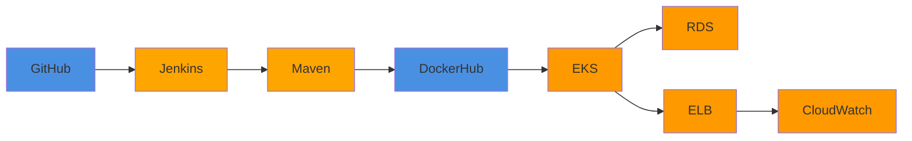

# Projeto 

## 1. Configuração AWS

### AWS CLI

Instalação e configuração:

```bash
aws configure
```

[Guia instalação AWS CLI](https://docs.aws.amazon.com/cli/latest/userguide/getting-started-install.html)


## 2. EKS - Cluster Kubernetes

O cluster **eks-store** foi criado na região **us-east-2** utilizando nodes do tipo **t3.medium**.


Para acessar o Cluster eks:
```bash
aws eks update-kubeconfig --name eks-store
```

## 3. Testes de Carga 

### HPA

Criar HPA (Horizontal Pod Autoscaler) para o deploy do gateway:

```bash
kubectl autoscale deployment gateway --cpu-percent=50 --min=1 --max=10
```

Verificar status do HPA:

```bash
kubectl get hpa  
```

### Executar Teste de Carga

```bash
kubectl run -i --tty load-generator --rm --image=busybox:1.28 --restart=Never -- /bin/sh -c "while sleep 0.01; do wget -q -O- http://gateway/health-check; done"
```

### Monitorar pods

```bash
watch -n 1 'kubectl get pods -l app=gateway'
```


### Testes funcionando

<div style="position: relative; padding-bottom: 56.25%; height: 0; overflow: hidden; max-width: 100%; height: auto;">
    <iframe src="https://www.youtube.com/embed/Wfk-lb8Y_Ro" frameborder="0" allowfullscreen style="position: absolute; top: 0; left: 0; width: 100%; height: 100%;"></iframe>
</div>


## 4. CI/CD

### Pipeline Jenkins

Foi implementado um pipeline de CI/CD utilizando Jenkins para automatizar o processo de build, push de imagens Docker e deploy no cluster EKS.

Cada microsserviço possui seu próprio Jenkinsfile com a mesma estrutura base, alterando apenas a variável `SERVICE` para identificar o serviço específico.

### Exemplo: Jenkinsfile do Product Service

```groovy
pipeline {
    agent any
    environment {
        SERVICE = 'product'
        NAME = "isavrodrigues/${env.SERVICE}"
    }
    stages {
        stage('Dependecies') {
            steps {
                build job: 'product', wait: true
            }
        }
        stage('Build') {
            steps {
                sh 'mvn -B -DskipTests clean package'
            }
        }
        stage('Build & Push Image') {
            steps {
                withCredentials([usernamePassword(
                    credentialsId: 'dockerhub-credential',
                    usernameVariable: 'USERNAME',
                    passwordVariable: 'TOKEN')])
                {
                    sh "docker login -u $USERNAME -p $TOKEN"
                    sh "docker buildx create --use --platform=linux/arm64,linux/amd64 --node multi-platform-builder-${env.SERVICE} --name multi-platform-builder-${env.SERVICE}"
                    sh "docker buildx build --platform=linux/arm64,linux/amd64 --push --tag ${env.NAME}:latest --tag ${env.NAME}:${env.BUILD_ID} -f DockerFile ."
                    sh "docker buildx rm --force multi-platform-builder-${env.SERVICE}"
                }
            }
        }
        stage('Deploy to EKS') {
            steps {
                withCredentials([
                    string(credentialsId: 'aws-access-key-id', variable: 'AWS_ACCESS_KEY_ID'),
                    string(credentialsId: 'aws-secret-access-key', variable: 'AWS_SECRET_ACCESS_KEY'),
                    string(credentialsId: 'aws-region', variable: 'AWS_REGION'),
                    string(credentialsId: 'eks-cluster-name', variable: 'CLUSTER_NAME')
                ]) {
                    sh "aws eks update-kubeconfig --region ${AWS_REGION} --name ${CLUSTER_NAME}"
                    sh "kubectl set image deployment/${env.SERVICE} ${env.SERVICE}=${env.NAME}:${env.BUILD_ID} -n default"
                    sh "kubectl rollout status deployment/${env.SERVICE} -n default"
                }
            }
        }
    }
}
```

### Fluxo do Pipeline


### Serviços Funcionando


## 6. PaaS (Platform as a Service)

### Serviços Utilizados

- **Amazon EKS**: Kubernetes gerenciado pela AWS 
- **Amazon RDS**: PostgreSQL gerenciado (backups automáticos, patches de segurança)
- **Elastic Load Balancing**: Distribuição automática de tráfego com health checks
- **CloudWatch**: Logs e métricas centralizados

### Responsabilidades

**AWS gerencia:**

- Infraestrutura, patches de segurança, alta disponibilidade do cluster e banco

**Fazemos:**

- Criação e versionamento das imagens Docker dos microserviços
- Configuração dos deployments, services e secrets no Kubernetes
- Ajuste de escalabilidade conforme necessário
- Definição dos schemas do banco de dados e configuração das conexões

### Arquitetura




